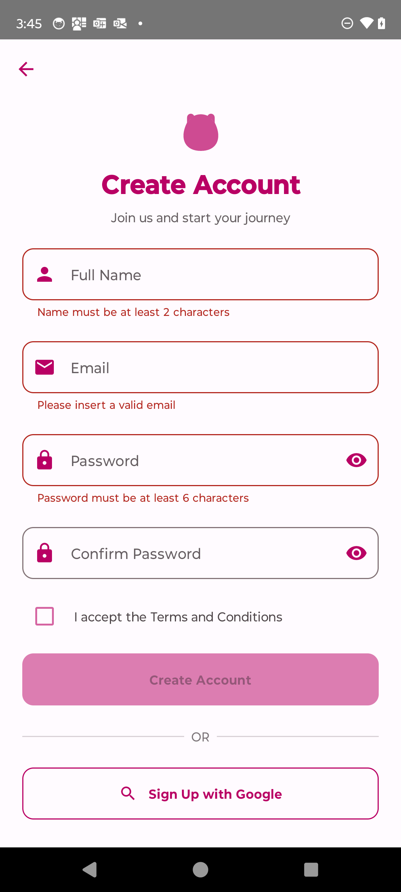
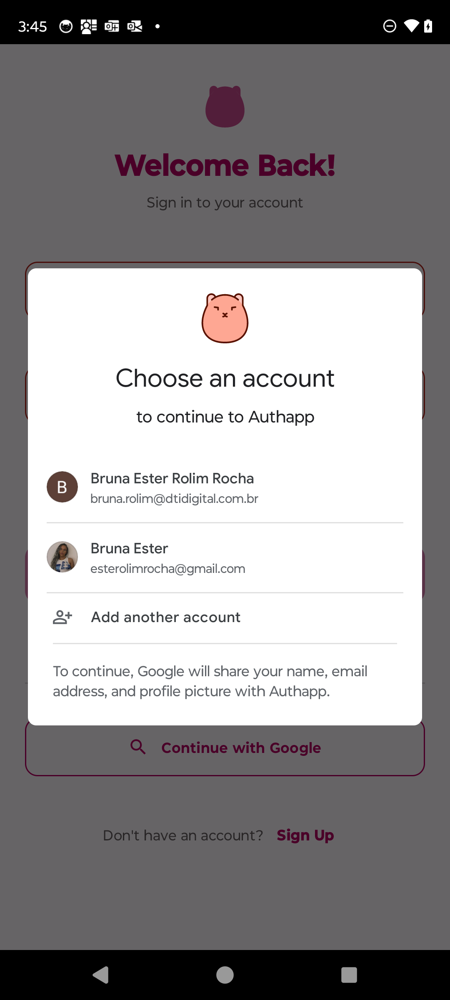
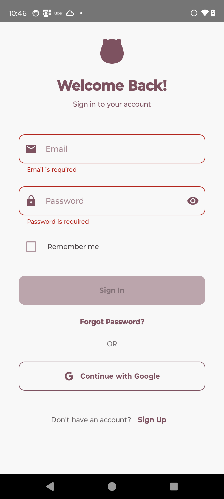
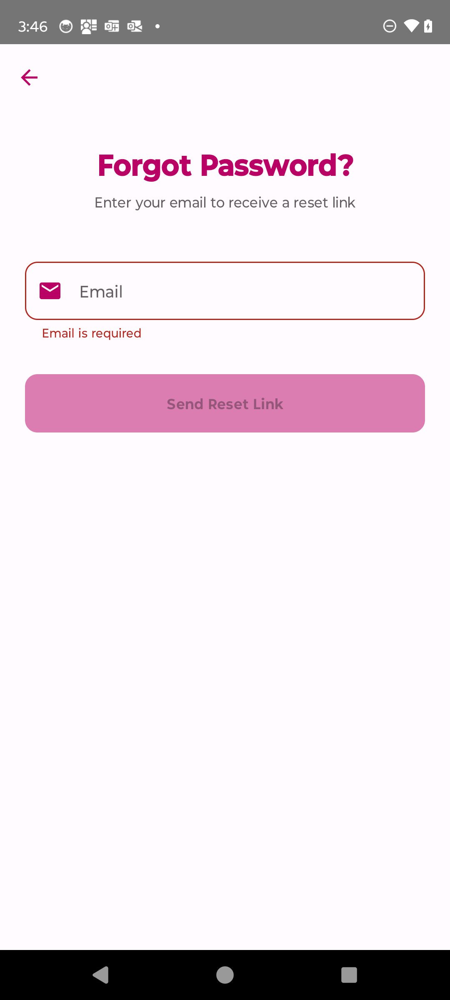
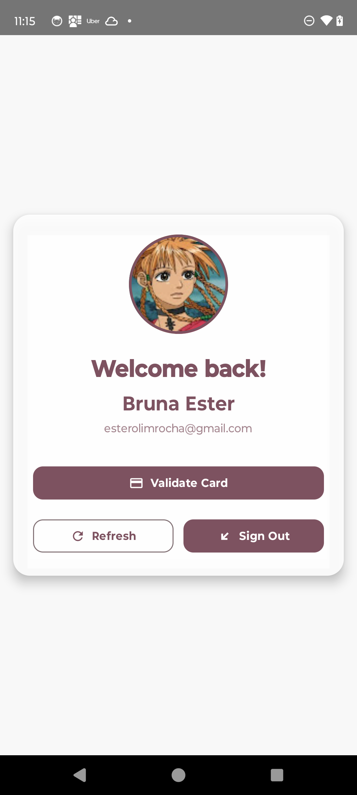
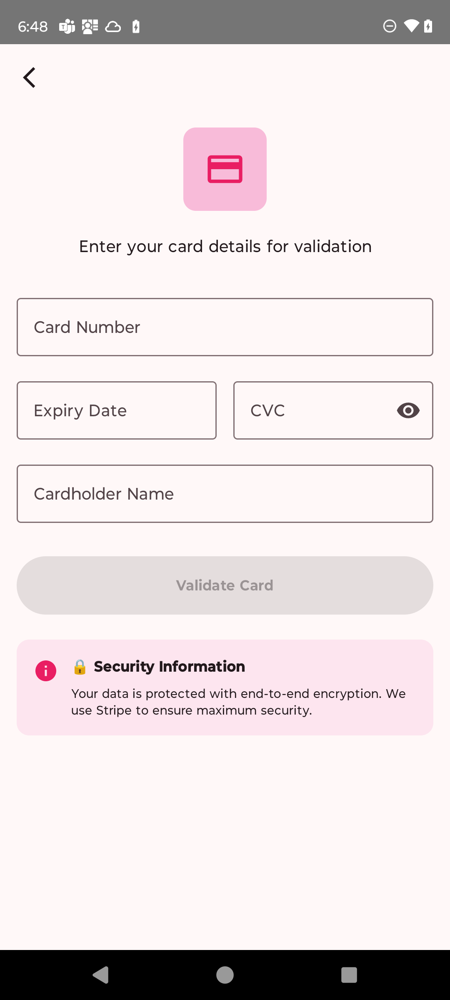

# 🔐 Authentication & Payment Card Validation App (Work in Progress)

This mobile application combines user authentication and payment card validation, built with **Kotlin**, **Jetpack Compose**, **MVVM**, and **Hilt** for dependency injection. The goal is to deliver a modern, robust authentication flow using email/password and Google Sign-In, alongside a custom payment card validation feature, all following Google's best practices and clean architecture principles.

## 🛠️ Technologies Used

- **Kotlin**
- **Jetpack Compose** – declarative UI development
- **MVVM Architecture** – clear separation of concerns
- **Hilt** – dependency injection
- **Firebase Authentication**
- **Google Sign-In**
- **Custom Payment Card Validation**
- **Password Reset** (via Firebase Hosting)

## 🚧 Project Status

This project is actively under development. Core authentication and card validation features are implemented and undergoing testing.

### Completed Features

- Full authentication flow (Sign Up, Sign In, Forgot Password)
- Firebase Authentication and Google Sign-In integration
- Real-time payment card validation with user feedback
- Navigation between screens using Jetpack Compose Navigation

### Features In Progress

- Payment success and failure screens are currently under development and not yet finalized.

## 📱 Screenshots

### Sign Up Screen

### Sign In Screen

### Forgot Password Screen

### Home Screen

### Card Validation Screen

*Note: Card validation screen provides real-time feedback during input.*

---

## 📋 Roadmap

- [✅] Firebase Authentication integration
- [✅] Complete Forgot Password flow
- [✅] Custom payment card validation logic
- [  ] Payment success and failure screens (in progress)
- [  ] Unit and instrumentation tests

## 🤝 Contributing

Contributions are welcome! Feel free to open issues or submit pull requests for improvements or suggestions.

## 📄 License

This project is licensed under the **MIT License**.

---

Built with ❤️ using Kotlin and Jetpack Compose.