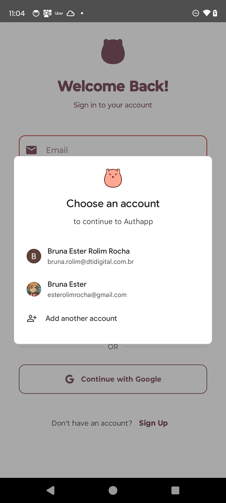

# 🔐 Authentication App (Work in Progress)

This is a mobile authentication project built using **Kotlin**, **Jetpack Compose**, **MVVM**, and *
*Hilt** for dependency injection. The goal is to create a modern and robust authentication flow
using **email/password** and **Google Sign-In**, following Google’s recommended best practices and
clean architecture principles.

## 🛠️ Technologies Used

- **Kotlin**
- **Jetpack Compose** – for declarative UI development
- **MVVM Architecture** – clean separation of concerns
- **Hilt** – for dependency injection
- **Firebase Authentication**
- **Google Sign-In**
- **Reset Password (w/ Firebase Hosting)**

## 🚧 Project Status

This is an **ongoing implementation**. Core features are being developed and tested. Below are
screenshots showing the current UI state of the app.

## 📱 Screenshots

### Create Account Screen

---

### Sign In Screen

### Forgot Password Screen

---

## Features Roadmap

- [✅] Firebase Authentication integration
- [✅] Complete "Forgot Password" flow
- [ ] Unit tests and instrumentation tests

## 🤝 Contributing

Feel free to open issues or pull requests if you'd like to contribute or suggest improvements. All
contributions are welcome!

## 📄 License

This project is licensed under the **MIT License**.

---

Built with ❤️ using Kotlin and Jetpack Compose.
