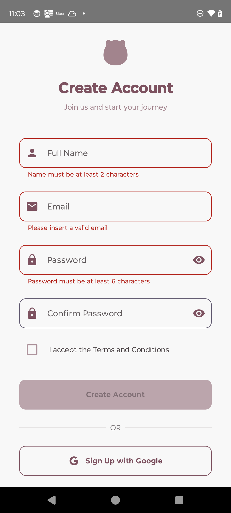

# Authentication

This mobile application built with **Kotlin**, **Jetpack Compose**, **MVVM**, and **Koin** for
dependency injection. The goal is to
deliver a modern, robust authentication flow using email/password and Google Sign-In, all following
Google's best practices and clean architecture
principles.

## Technologies Used

- **Kotlin**
- **Jetpack Compose** – declarative UI development
- **MVVM Architecture** – clear separation of concerns
- **Koin** – dependency injection
- **Firebase Authentication**
- **Google Sign-In**
- **Password Reset** (via Firebase Hosting)
- **Sentry** – real-time error monitoring and performance tracking

## Project Status

This project is actively under development. Core authentication are under improvements

### Completed Features

- Full authentication flow (Sign Up, Sign In, Forgot Password)
- Firebase Authentication and Google Sign-In integration
- Real-time payment card validation with user feedback
- Navigation between screens using Jetpack Compose Navigation
- Sentry Integration: The app now features robust error and performance monitoring with Sentry. All
  crashes, exceptions, and ANRs are automatically captured, helping ensure reliability and fast
  issue resolution.
- Navigation Tracking in Jetpack Compose: While Sentry’s navigation tracking is automatic for
  traditional navigation, in Jetpack Compose we’ve implemented custom breadcrumbs to track user
  navigation between screens. This provides valuable context for debugging and user flow analysis.

## Screenshots - Evidence

### Sign Up Screen

### Sign In Screen

### Home Screen

---

## Roadmap

- [✅] Firebase Authentication integration
- [✅] Complete Forgot Password flow
- [✅] Google Sign-In/Sign-Up integration
- [✅] Sentry Integration for error monitoring and performance tracking

## Contributing

Contributions are welcome! Feel free to open issues or submit pull requests for improvements or
suggestions.

## License

This project is licensed under the **MIT License**.

---

Built with ❤️ using Kotlin and Jetpack Compose.